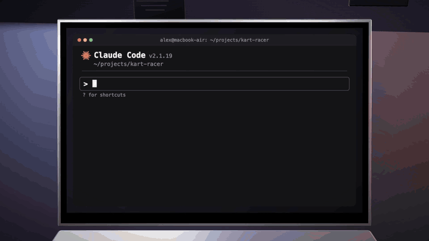
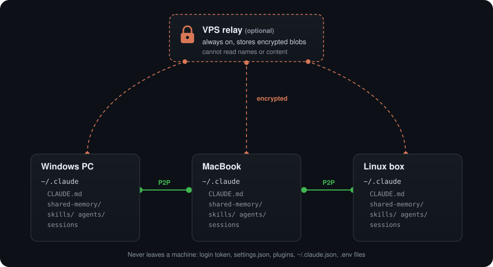

# claude-hivemind

### One Claude Code brain on every computer you own. Real time. No cloud.

[](https://github.com/Iliesseu28/claude-hivemind/actions/workflows/e2e.yml)


[](LICENSE)

Teach Claude something on your laptop: your desktop already knows it.
Start a session on Windows, close the lid, open your Mac, type `/resume`, keep going.

Memory, `CLAUDE.md`, skills, agents, slash commands, settings **and sessions**, synced peer to peer
in seconds across all your machines, with an optional VPS relay that only ever stores encrypted data.

<p align="center"><a href="docs/demo.mp4"></a><br><sub>Click for the full-quality video</sub></p>

<p align="center"></p>

## Set it up with one sentence

Open Claude Code on your first computer and paste:

```text
Clone https://github.com/Iliesseu28/claude-hivemind and follow skills/hivemind/SKILL.md
to set up claude-hivemind on this machine.
```

Claude installs Syncthing, pairs your machines, checks that no secret is about to travel, and wires
everything. Then do the same on each other computer. About 10 minutes the first time, zero after.

Prefer a plugin?

```text
/plugin marketplace add Iliesseu28/claude-hivemind
/plugin install hivemind@claude-hivemind
```

Then just say *"set up hivemind"*.

## Why this exists

Everything that makes Claude Code **yours** lives in `~/.claude`, on one disk:

- the **memory** Claude wrote about you, your projects, your preferences
- your **`CLAUDE.md`** rules
- your **skills, agents and commands**
- every **session** you might want to resume

Get a second computer and you get an amnesiac Claude. Copy files by hand and they drift within a
day. Throw `~/.claude` into Dropbox, iCloud or OneDrive and you sync your **login token**, gigabytes
of caches, Windows paths onto your Mac, and half-written session files.

claude-hivemind syncs exactly the right things, the right way.

## What travels, what never does

| Travels, in real time | Never leaves the machine |
|---|---|
| `CLAUDE.md` | `.credentials.json` (your login) |
| memory (`~/.claude/shared-memory`) | `settings.json` as a whole (OS-specific hooks and paths) |
| `skills/`, `agents/`, `commands/`, `output-styles/` | `plugins/` (absolute paths inside) |
| the settings you pick (`shared-settings.json`) | `~/.claude.json` (account, MCP servers) |
| sessions: `/resume` from any machine | `.env`, keys, `node_modules`, caches |

It is a **whitelist**: whatever Claude Code adds to `~/.claude` tomorrow stays local until you decide.

## How it works: four tricks

1. **Syncthing, peer to peer.** Your machines talk to each other directly over TLS. No account, no
   server of ours, open source since 2013. Changes land in seconds.
2. **One memory for every folder.** By default Claude Code keeps a separate memory per working
   folder. `autoMemoryDirectory` points every session to `~/.claude/shared-memory`, and that folder travels.
3. **Sessions across different paths.** Claude Code files sessions under the encoded folder you
   started in: `C:\Users\alex` becomes `projects/C--Users-alex`, `/Users/alex` becomes
   `projects/-Users-alex`. Different names on each OS, so hivemind links them under **one** share
   ID. `claude --resume` then lists the sessions of every machine.
4. **Settings that don't break.** A SessionStart hook copies only the keys you choose from
   `shared-settings.json` into each machine's `settings.json`. Your Windows hooks and Mac
   permissions stay where they belong.

## The relay: sync while your machines are never on together

Syncthing needs two machines online at the same time. Add a small VPS (a few euros a month) as an
**untrusted** device: Syncthing encrypts file contents **and names** on your machine, with a
password the server never receives. PC off, Mac on? It still syncs, through the relay.

Bonus: an encrypted off-site copy of your whole Claude setup, restorable with `syncthing decrypt`.
Details and threat model: [`relay.md`](skills/hivemind/references/relay.md).

## Built from real incidents

This started as a personal setup (a Windows PC, a Mac and a VPS) and every scar is now a guard rail:

- **12 secrets hiding in memory files.** Past sessions had written API keys down "to remember them".
  `brain` refuses to share until `scan` is clean, and never prints a value.
- **3 days of silent one-way sync.** A share left in receive-only mode sends nothing, with no error.
  `status` flags `ONE-WAY`; `two-way` refuses to flip before the first sync is really complete.
- **A relay stuck between 16 and 62%.** Syncthing v2 opens 3 connections per device; with an
  untrusted device that breaks big files. hivemind forces one connection on both sides.
- **"The newest file wins" lost 19 API keys.** Dates lie after a `git stash`. The skill merges
  conflicts by content, and the joining machine is backed up before it receives anything.
- **333 skills that never reached Windows.** They were symlinks. `doctor` warns about them.

All of them: [`pitfalls.md`](skills/hivemind/references/pitfalls.md).

## Commands

One file, standard library only: [`skills/hivemind/scripts/hivemind.py`](skills/hivemind/scripts/hivemind.py).
Every command is idempotent and safe to run again.

| Command | What it does |
|---|---|
| `doctor` | what is installed, paired, shared; what to do next (changes nothing) |
| `id` / `pair <ID> --name Mac` | show this machine's ID / trust another machine of yours |
| `scan [--sessions]` | find secrets before they travel (file and line, never the value) |
| `brain --role primary\|secondary` | share `CLAUDE.md`, memory, skills, agents, commands, settings |
| `two-way` | a joining machine starts sending, once its first sync is complete |
| `sessions [--cwd PATH --id ID]` | share the sessions of a folder: `/resume` everywhere |
| `status` | every share, as seen by every other machine |
| `relay-server --ssh user@host` / `relay --device ID --address host` | set up the encrypted relay |
| `remove` | stop sharing; never deletes a file |

## Tested for real, on three OSes

[`tests/e2e_test.py`](tests/e2e_test.py) starts three real Syncthing instances (two "computers" and
a relay) and runs every command like a user would. Among its checks: the login token and `.env`
files never travel, a machine's own skills survive joining, sessions from two different home paths
show up on both sides, the relay holds **zero readable bytes**, and a memory written on one machine
reaches the other **through the relay alone** while the two are cut off from each other.
CI runs it on Linux, macOS and Windows, and every Monday against the latest Syncthing.

## FAQ

**Can I use Claude on two machines at the same time?** Yes, in different sessions. Just never
keep the *same* session open on two machines.

**Does it work with the VS Code or JetBrains extension?** They run Claude Code, which uses the
same `~/.claude`, so yes.

**What about Codex CLI or Gemini CLI?** The script targets Claude Code, but the recipe (a whitelist
share of the config folder) works for `~/.codex` or `~/.gemini`. PRs welcome.

**Who can see my data?** Only your own machines. The relay, if you add one, stores ciphertext.

**I deleted a memory by mistake.** Every machine keeps deleted and replaced files for 30 days in
`~/.claude/.stversions`.

**How do I undo everything?** `python hivemind.py remove`: shares stop, the hook goes away,
every file stays where it is.

## Contributing

Issues and PRs welcome, especially field reports from setups the tests do not cover (Linux
desktops, WSL, several relays). Run `python tests/e2e_test.py` before opening a PR.

If this saved you from an amnesiac Claude, a star helps other people find it.

## License

MIT. Built on [Syncthing](https://syncthing.net), which does the hard part.
